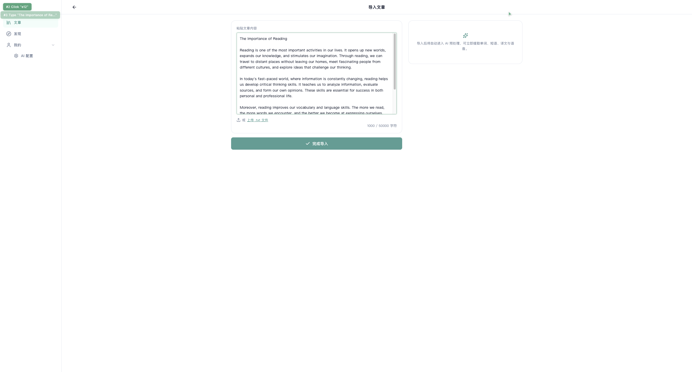
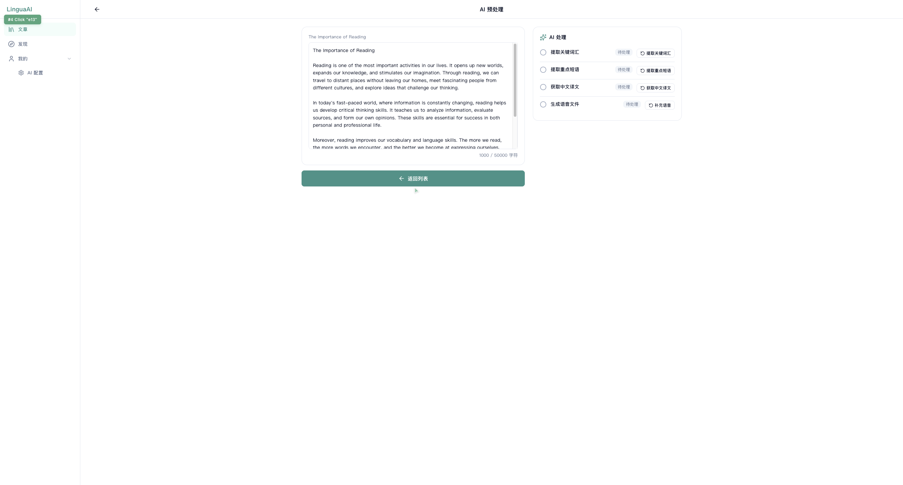
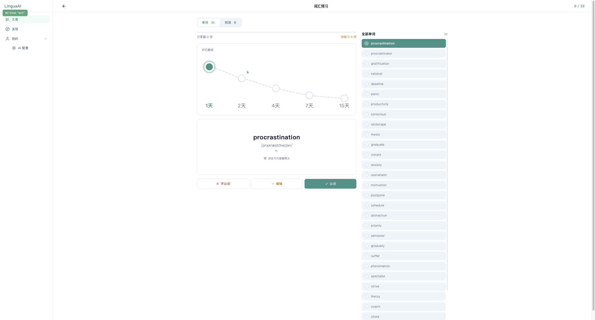
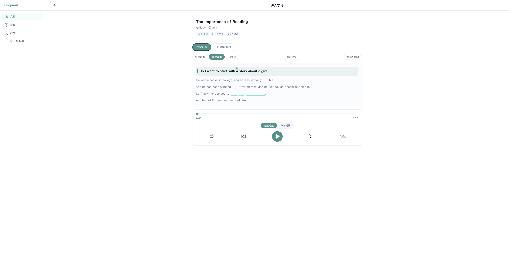

# LinguaAI — 用 AI 学英语

把任何英文文章变成你的私人英语课堂。导入文章 → AI 提取生词短语 → 闪卡预习 → 逐句精听 → 听力挑战 → 间隔复习，一条龙搞定。

还能从 TED 演讲直接加入学习，自动抓取文字稿，边听边学。

## 核心功能

### 导入文章

- 粘贴文本或拖拽 `.txt` 文件
- 自动保存，一键进入 AI 预处理
- 支持自定义标题



### AI 预处理

- 自动提取生词和短语
- 智能分句，为后续学习拆好结构
- 一键翻译全文
- 支持 mock 模式（无需 API 即可体验）和真实 AI 模式



### 词汇预习

- 闪卡模式，翻面看释义
- 三档自评：不会 / 模糊 / 掌握
- 单词和短语分类学习
- 记忆曲线跟踪，掌握程度一目了然



### 深入学习

- **播客模式**：整篇播放，字幕同步高亮，句子级控制
- **逐句精听**：三档听写难度，逐字母输入，即时判分
- **听力挑战**：AI 智能出题，三种题型，整卷判分
- AI 译文随时开关
- 播放模式切换、空格跳空、全文/挖空切换



### 发现页 — TED 频道

- 浏览 TED 最新演讲
- 按时长筛选（≤6 分钟 / 6-12 分钟 / 12 分钟+）
- 无限滚动加载
- 一键加入学习：自动抓取文字稿，存为文章
- 已加入的演讲自动标记，避免重复


### 学习进度

- 每篇文章显示学习进度条
- 今日统计：导入数、学习数、掌握数
- 间隔重复调度，复习提醒
- 卡片进度回显（词汇 / 短语 / 精听）


### TTS 语音

- 接入火山引擎豆包 TTS
- 整句和全文语音播放
- 配置页面一键测试连接

## 快速开始

### 环境要求

- Node.js 20+
- npm 10+

### 安装

```bash
git clone https://github.com/NewPZP/learn_english_with_ai.git
cd learn_english_with_ai
npm install
```

### 启动开发服务器

```bash
npm run dev
```

打开 http://localhost:5173 即可使用。

### 使用 Mock 模式（无需配置 AI）

默认使用 mock 模式，开箱即用。你可以导入文章、体验全部学习流程，不需要任何 API Key。

### 配置真实 AI（可选）

1. 点击侧边栏「AI 配置」
2. 填入你的 AI 服务地址和 API Key
3. 填入火山引擎 TTS 配置（如需语音）
4. 点击「测试连接」验证
5. 保存后所有 AI 功能切换为真实模型

### 部署发现页 Worker（可选）

发现页 TED 频道需要一个 Cloudflare Worker 后端：

```bash
cd worker
npm install --legacy-peer-deps
npx wrangler deploy
npx wrangler secret put API_TOKEN
```

部署后在应用「发现页」输入 Worker 地址和 Token 即可使用。

## 技术栈

| 层级 | 技术 |
|------|------|
| 前端 | React 19 + TypeScript 6 + Vite 8 |
| 路由 | React Router 7 |
| 样式 | CSS 变量设计系统（亮/暗主题） |
| 测试 | Vitest 4 + Testing Library + jsdom |
| Lint | oxlint |
| 后端 | Cloudflare Workers（TypeScript） |
| AI | OpenAI 兼容接口 + 火山引擎 TTS |

## 项目结构

```
learn_english_with_ai/
├── app/                    # React 前端应用
│   └── src/
│       ├── pages/          # 页面组件
│       ├── components/     # 共享组件（侧边栏、顶栏、布局）
│       ├── lib/            # 业务逻辑（文章、AI、词汇、发现页）
│       ├── styles/         # 全局样式
│       └── routes.ts       # 路由定义
├── worker/                 # Cloudflare Worker（TED 数据后端）
│   └── src/
│       ├── parsers.ts      # 纯函数（RSS 解析、transcript 清洗）
│       └── index.ts        # Worker 入口（路由、缓存、CORS）
├── docs/
│   └── screenshots/        # 功能截图
└── README.md
```

## 开发

```bash
# 前端开发
npm run dev          # 启动开发服务器
npm run build        # 构建生产版本
npm run test         # 运行测试
npm run test:watch   # 测试监听模式
npm run lint         # 代码检查

# Worker 开发
cd worker
npx wrangler dev     # 本地运行 Worker
npx vitest run       # 运行 Worker 测试
```

## 路线图

- 更多频道：BBC Learning English、VOA Special English
- 更多 AI 出题题型
- 学习数据云端同步
- 移动端适配

## License

MIT
