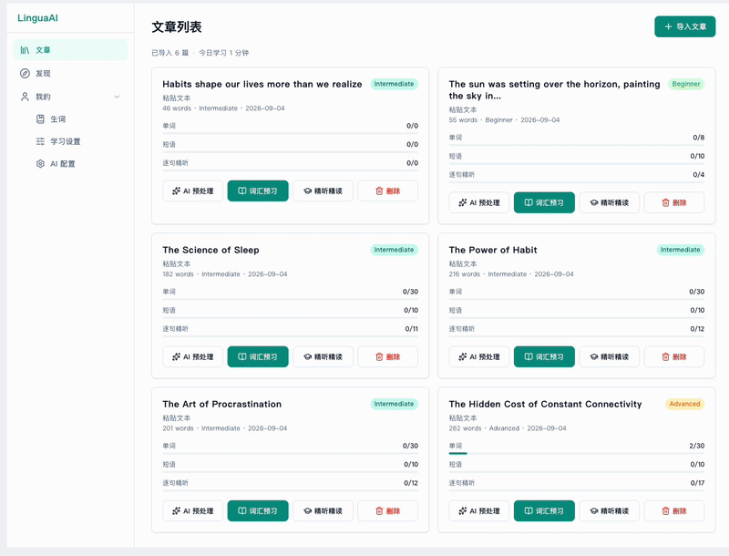

# LinguaAI

桌面版 AI 英语学习应用。导入英文文章 → AI 提取生词短语 → 闪卡预习 → 逐句精听/播客/听力挑战 → 学习进度跟踪。支持从 TED 频道直接加入学习。



## 快速开始

```bash
npm install
npm run dev          # http://localhost:5173
```

默认 mock 模式开箱即用。真实 AI 在「AI 配置」页填入 OpenAI 兼容接口和火山 TTS 配置。

## 工程结构

```
learn_english_with_ai/
├── app/                         # React 前端（Vite + TS6 + React19）
│   └── src/
│       ├── pages/               # 页面组件（每功能一页）
│       ├── components/          # 通用组件（SidebarNav, PageTopbar, ConfigPanel）
│       ├── lib/                 # 领域逻辑（纯函数 + 少量 hooks）
│       │   ├── articles.ts      # Article 模型 + localStorage 持久化
│       │   ├── ai/              # AI 适配器层（mockAdapters / realAdapters）
│       │   ├── channels.ts      # 频道注册表（TED / BBC / VOA）
│       │   ├── discover.ts      # 发现页 API 客户端 + 客户端缓存
│       │   ├── studyProgress.ts # 学习进度调度
│       │   ├── wordProgress.ts  # 单词掌握进度
│       │   └── aiConfig.ts      # AI 配置读写
│       ├── routes.ts            # 路由常量（唯一来源）
│       └── App.tsx              # 路由表
└── worker/                      # Cloudflare Worker（TED 数据后端）
    └── src/
        ├── parsers.ts           # 纯函数（RSS 解析 / transcript 清洗 / 版本哈希）
        └── index.ts             # Worker 入口：三端点 + 日缓存 + CORS + token
```

## 页面与路由

| 路径 | 页面 | 职责 |
|------|------|------|
| `/articles` | ArticleListPage | 文章列表 + 今日统计 + 进度回显 |
| `/articles/import` | ImportArticlePage | 粘贴/拖拽导入文章 |
| `/articles/:id/process` | ImportArticlePage（加工模式） | AI 预处理：提取生词短语、分句、生成 TTS |
| `/articles/:id/words` | WordPreviewPage | 闪卡预习（单词 + 短语 tab） |
| `/articles/:id/podcast` | PodcastPage | 深入学习：播客/逐句精听/AI 测验 tab |
| `/discover` | DiscoverPage | 频道广场 |
| `/discover/:channelId` | ChannelPage | TED 演讲列表 + 时长筛选 + 加入学习 |
| `/ai-config` | AiConfigPage | AI 数据源 / 文字模型 / 声音模型配置 |

## 核心数据流

```
导入文本 → saveArticle() → Article (processing 缺失)
    ↓
AI 预处理（getTextAdapter().extractWords/Phrases/Sentences）
    ↓
attachProcessing() → Article.processing { words, phrases, sentences, audio }
    ↓
后续页面消费 processing：
  - WordPreviewPage → words / phrases
  - PodcastPage     → sentences + audio (TTS)
```

Article 模型关键字段：`id, title, source, content, wordCount, difficulty, createdAt, sourceUrl?, processing?`

## AI 适配器层

`lib/ai/index.ts` 的 `getTextAdapter()` / `getVoiceAdapter()` 根据 `aiConfig` 切换：

- **mock 模式**：返回 `mockAdapters.ts` 的固定测试数据，无需网络
- **real 模式**：`realAdapters.ts` 调用 OpenAI 兼容接口（文字）+ 火山引擎 TTS（语音）

开发模式下 `devProxy.ts` 通过 Vite proxy 规避浏览器 CORS。

## Cloudflare Worker

| 端点 | 说明 |
|------|------|
| `GET /api/channels` | 静态频道列表 |
| `GET /api/channels/:channel/talks?page=&force=` | 分页 + 日缓存懒刷新 + 版本哈希 |
| `GET /api/channels/:channel/talks/:talkId/transcript` | 抓取 transcript 文本，null → 404 |

部署：`cd worker && npm install --legacy-peer-deps && npx wrangler deploy && npx wrangler secret put API_TOKEN`

## 测试约定

- 测试文件名与源文件同名，`.test.ts` / `.test.tsx`
- 工具函数尽量写成纯函数，便于单测（如 `articles.ts` 的 `countWords`、`worker/parsers.ts` 全部）
- 页面测试用 `@testing-library/react` + `jsdom`，通过 `data-testid` 或文本定位元素
- localStorage 在 `beforeEach` 中 `clear()`，隔离测试数据

```bash
npm run test         # 前端
cd worker && npx vitest run   # Worker
```

## 开发

```bash
npm run dev          # 开发服务器
npm run build        # tsc -b && vite build
npm run lint         # oxlint
npm run test         # vitest run
```

## License

MIT
